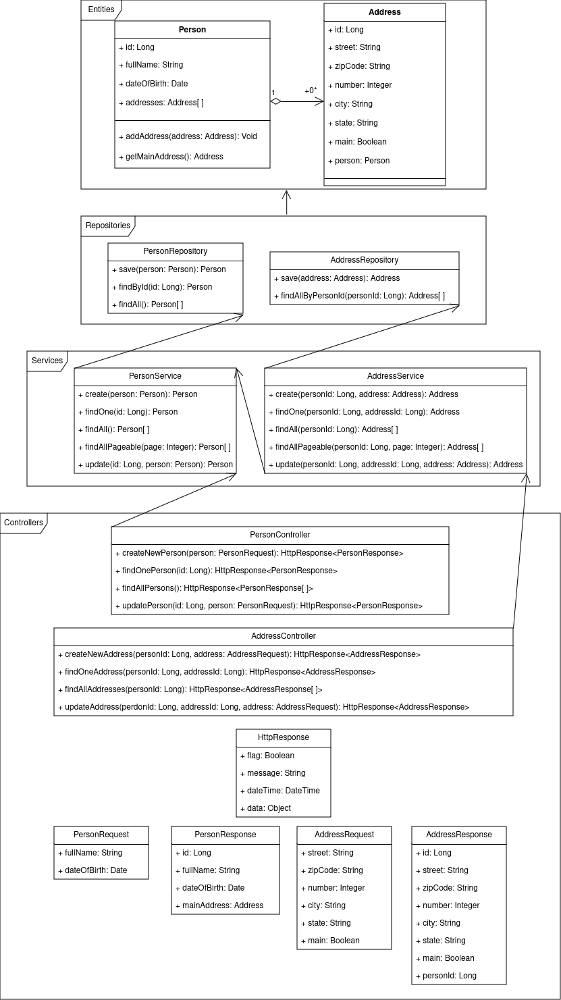

## 💛 Teste:

<h3>Utilizando seus conhecimentos, desenvolva uma nova funcionalidade de gerenciamento de pessoas.
A apresentação da proposta inicial a entrega final do código será o digrama de classes, e o código fonte da funcionalidade.</h3>

A API desenvolvida deve permitir:
<ul>
    <li>Criar, editar e consultar uma ou mais pessoas;</li>
    <li>Criar, editar e consultar um ou mais endereços de uma pessoa;</li>
    <li>Poder indicar qual endereço será considerado o principal de uma pessoa.</li>
</ul>

Uma pessoa deve possuir os seguintes dados:
<ul>
    <li>Nome completo</li>
    <li>Data de nascimento</li>
    <li>Endereços:
        <ul>
            <li>Logradouro</li>
            <li>CEP</li>
            <li>Número</li>
            <li>Cidade</li>
            <li>Estado</li>
        </ul>
    </li>
</ul>

✨ Requisitos mínimos necessários:
<ul>
    <li>O código deve ter cobertura total de condições;</li>
    <li>O código deve ter cobertura de linhas de no mínimo 80%;</li>
    <li>O código deve respeitar os conceitos de Design Patterns, SOLID e Clean Code;</li>
    <li>Toda a API deve ser desenvolvida no formato REST.</li>
</ul>

- Diagrama de classes:

